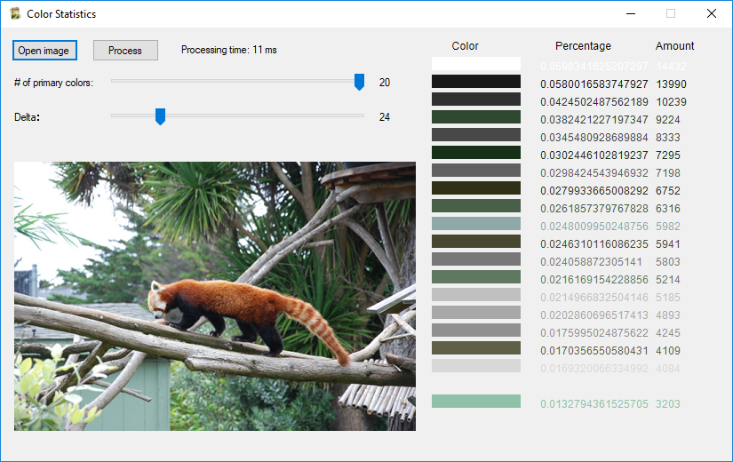

A class for pulling the most common colors from an image. Allows you to select the quantization delta. The smaller the delta the more accurate the color. This also increases the number of similiar colors though.

